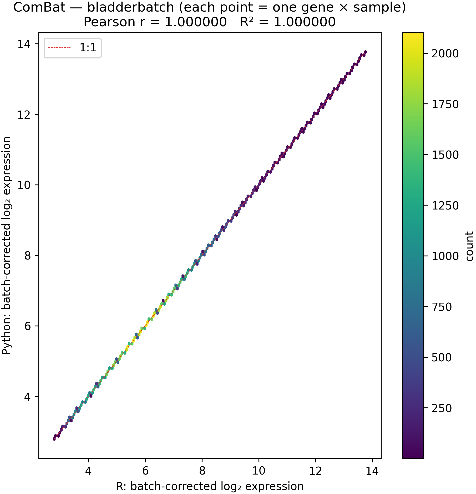
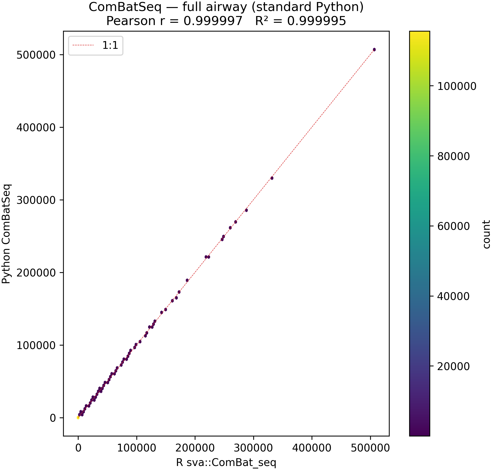
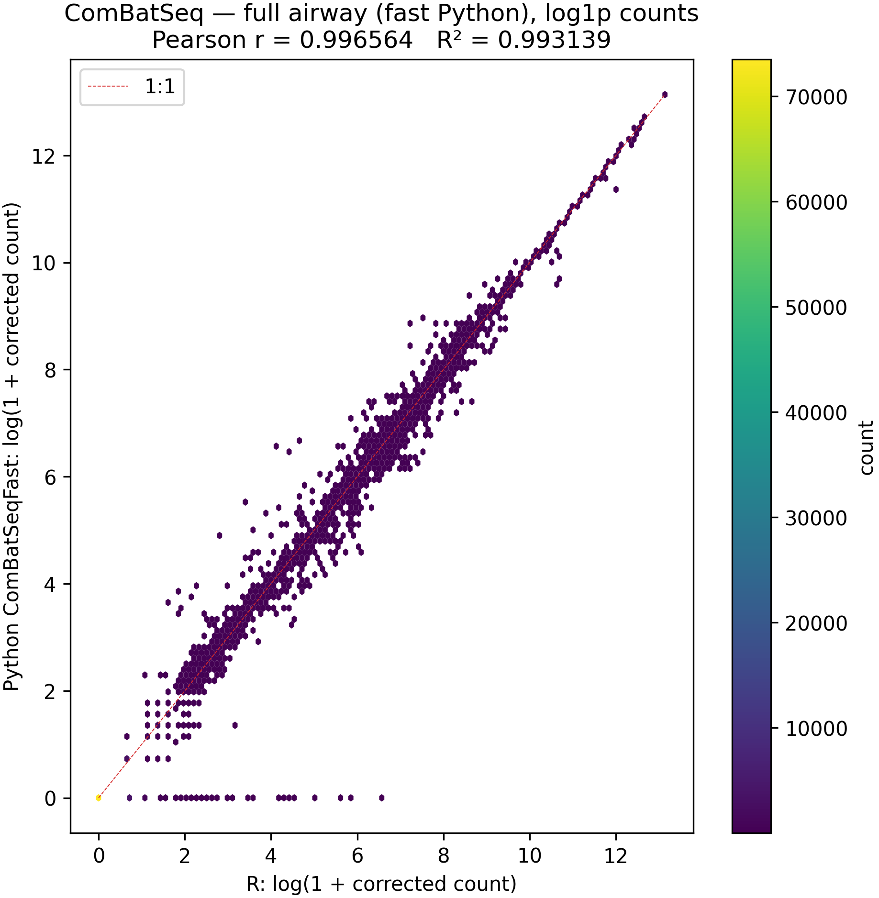
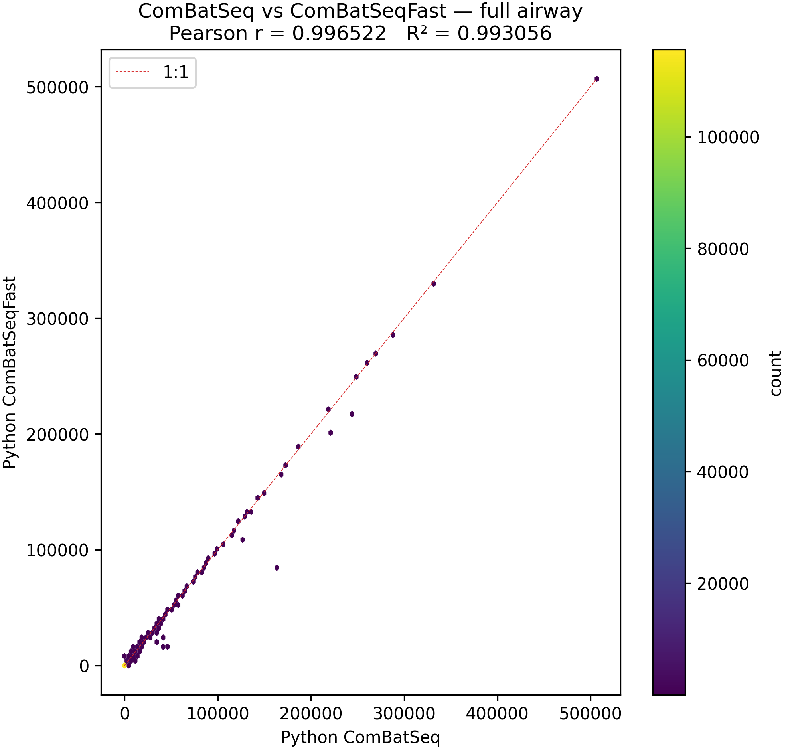

# Numerical parity of md_combat with Bioconductor sva on microarray and RNA-seq reference data

| | |
|:---|:---|
| **Type** | Application note |
| **Date** | 3 April 2026 |
| **Figures** | [`figures/parity/`](figures/parity/) (regenerate: [`examples/combat_comparison.ipynb`](../examples/combat_comparison.ipynb)) |

> **Purpose.** Document numerical agreement between the Python package *md_combat* and Bioconductor *sva* (`ComBat`, `ComBat_seq`) on full bladderbatch and full airway benchmark data, with precomputed R benchmark references in `tests/expected/`.

* * *

## Abstract

**Background.** Batch effect correction is widely performed with the Bioconductor package *sva* (`ComBat`, `ComBat_seq`). A Python reimplementation, *md_combat*, is useful for Python-native pipelines and services.

**Methods.** We compared *md_combat* to outputs of `sva::ComBat` and `sva::ComBat_seq` on the same bundled datasets used for package testing: the bladderbatch microarray study (22 283 probes × 57 samples) and the airway RNA-seq experiment (64 102 genes × 8 samples). R reference matrices were precomputed with `Rscript scripts/generate_expected.R` and stored as Parquet **benchmark reference** files under `tests/expected/`. Agreement was quantified by the maximum absolute element-wise difference (ComBat) or, for ComBat-seq, by Pearson *r* and *R*² = *r*² on **log(1 + corrected count)** for every aligned matrix element after flattening (the same transform is used for RNA-seq hexbin figures so density is not dominated by zeros and small counts). RNA-seq plots subsample up to 120 000 gene × sample pairs for visualization. Wall-clock time was measured for full-airway fits on one workstation.

**Results.** ComBat: maximum |Python − R| = 6.22 × 10⁻¹⁵, *r* = 1.000000. ComBat-seq on full airway vs R benchmark reference on **log(1 + count)**: standard Python *r* = 0.996706 (*R*² = 0.993423); ComBatSeqFast *r* = 0.996538 (*R*² = 0.993088). Standard vs fast Python on log(1 + count): *r* = 0.999788. Standard ComBat-seq required 395.6 s (6.59 min); ComBatSeqFast required 1.9 s (~206× faster) on the same hardware.

**Conclusion.** *md_combat* reproduces R ComBat at machine precision. ComBat-seq agrees with R at high correlation on log-transformed corrected counts; the fast solver remains close to the standard path on that scale while offering large speed gains. Figures and commands below support independent reproduction.

**Keywords:** batch effect; ComBat; ComBat-seq; sva; Python; reproducibility

* * *

## 1. Introduction

Unwanted batch variation confounds high-throughput genomics. Johnson *et al.* introduced ComBat for continuous expression data (1); Zhang *et al.* extended the framework to RNA-seq counts as ComBat-seq (2). The reference implementation lives in the Bioconductor package *sva* (3). *md_combat* is a Python translation intended for parity with *sva* on representative data while remaining testable without an R runtime in continuous integration. This application note documents quantitative agreement and runtime on two standard datasets bundled with the package.

* * *

## 2. Materials and methods

### 2.1 Software

- **R reference:** *sva* `ComBat` / `ComBat_seq`, as executed when generating benchmark reference outputs. The parity notebook reported **R version 4.5.3 (2026-03-11)** on the machine used for the run summarized here.
- **Python:** *md_combat* (repository version under test), Python 3.11+, NumPy, pandas, SciPy, statsmodels; ComBat-seq **standard** path uses per-gene `statsmodels` negative binomial GLM with Nelder–Mead; **fast** path uses a batched Newton–Raphson solver (see `IMPLEMENTATION.md`).

### 2.2 Datasets

| Analysis | Source | Dimensions | Outcome scale |
|----------|--------|------------|---------------|
| ComBat | Bioconductor *bladderbatch* (`exprs(bladderEset)`) | 22 283 × 57; 5 batches | log₂-normalised microarray expression; ComBat output on the same scale |
| ComBat-seq | Bioconductor *airway* (bundled Parquet) | 64 102 × 8; cell line as batch, dexamethasone treatment as covariate | Integer counts adjusted to non-negative integers |

### 2.3 R benchmark reference outputs

Frozen R outputs were written with `scripts/generate_expected.R` to `tests/expected/` (e.g. `bladderbatch_combat.parquet`, `airway_full_combat_seq.parquet`). These Parquet files are the **benchmark references** against which Python is compared. Regeneration requires R and Bioconductor dependencies; **Python tests and this comparison do not call R at runtime.**

### 2.4 Statistical summaries

- **ComBat:** *D* = max*i*,*j* |*Y*Py*ij* − *Y*R*ij*|; Pearson *r* across all elements.
- **ComBat-seq:** Pearson *r* and *R*² = *r*² between flattened, aligned vectors of **log(1 + corrected count)** (Python vs R, or fast vs standard). Hexbin scatter displays use the same log(1 + *x*) values on both axes with a diagonal reference (1:1 line).

### 2.5 Compute environment (reporting run)

Wall times for full-airway ComBat-seq were taken from `examples/combat_comparison.ipynb` (`time.perf_counter()` around `fit_transform`). Times are **hardware-dependent** and are reported here as observed on the author’s run, not as benchmarks.

### 2.6 Figure generation

Figures were saved by the same notebook to `docs/figures/parity/` at 300 dpi (see notebook for `plot_11_hexbin`).

### 2.7 Viewing this file and the figures

- **VS Code / Cursor:** Open **Markdown: Open Preview** with **this `.md` file** focused. The document starts with a normal `#` title (no YAML), so the preview should resemble a typeset note. Image paths are relative to this file’s folder (`docs/`): `./figures/parity/*.png`. If images are missing, run the notebook once or confirm the PNGs exist under `docs/figures/parity/`.
- **Strict preview security:** If the preview blocks local images, allow workspace content (Command Palette → “Markdown: Change Preview Security Settings”).
- **GitHub:** Same relative image rules; commit PNGs under `docs/figures/parity/`.
- **Static-site generators (Hugo, Eleventy, …):** This file intentionally has **no YAML front matter** so generic Markdown previews stay clean. To publish with a generator that needs `title` / `date` in front matter, prepend the block from [`APP_NOTE_SSG_METADATA.yaml`](APP_NOTE_SSG_METADATA.yaml) to a copy of this document (or merge in your build step).

* * *

## 3. Results

### 3.1 ComBat (bladderbatch)

**Table 1.** ComBat agreement, full bladderbatch matrix.

| Quantity | Value |
|----------|--------|
| max \|Py − R\| | 6.22 × 10⁻¹⁵ |
| Pearson *r* | 1.0000000000 |
| *R*² (= *r*²) | 1.0000000000 |

**Figure 1.** Hexbin density of R (*x*) vs Python (*y*) batch-corrected log₂ expression; each point is one gene × sample (subsampled for plotting if needed). Diagonal: perfect agreement.

### 3.2 ComBat-seq (airway, full gene set)

**Table 2.** Pearson *r* and *R*² on **log(1 + corrected count)** vs R benchmark reference (64 102 × 8), and wall time.

| Comparison | *r* | *R*² | Wall time (s) |
|------------|-----|------|----------------|
| Python ComBatSeq (standard) vs R | 0.996706 | 0.993423 | 395.6 |
| Python ComBatSeqFast vs R | 0.996538 | 0.993088 | 1.9 |
| ComBatSeqFast vs ComBatSeq (both Python) | 0.999788 | 0.999577 | — |

Speedup (standard / fast) ≈ **205.8×** on this run.

**Figure 2.** R vs Python ComBat-seq (standard), full airway; axes are log(1 + corrected count).

**Figure 3.** R vs Python ComBatSeqFast, full airway; axes are log(1 + corrected count).

**Figure 4.** Python standard vs Python fast, full airway; axes are log(1 + corrected count).

* * *

## 4. Discussion

ComBat is a deterministic linear algebra and empirical-Bayes pipeline in double precision; agreement at ~10⁻¹⁵ is consistent with identical algorithms and floating-point order. ComBat-seq depends on negative binomial GLM fitting: R’s *sva* uses the *edgeR*-related machinery, while Python’s standard path uses *statsmodels* Nelder–Mead per gene. **Pearson *r* on raw corrected counts** is very high for the standard path vs R because the values are near-integers with strong pointwise agreement; **on log(1 + count)** the standard and fast Python paths both correlate with R at a similar level (*r* ≈ 0.997 here), while the two Python implementations agree even more closely with each other (*r* ≈ 0.9998), which matches the interpretation that NM and NR mainly diverge in detail that is compressed on the log scale. For large gene sets, **ComBatSeqFast** is the practical default; the standard implementation remains useful as a slower reference.

Limitations: R benchmark reference files depend on R/Bioconductor versions at generation time; hexbin figures subsample points so the *r* shown in the figure title can differ slightly from the full-matrix *r* in Table 2; wall times are single-machine snapshots.

* * *

## 5. Data and code availability

- **Repository:** *md_combat* source, tests, `scripts/generate_expected.R`, `scripts/export_datasets.R`, and `examples/combat_comparison.ipynb`.
- **Reproduction:** `uv sync --extra dev`; generate or verify `tests/expected/*.parquet`; run the notebook from the repository root. Full standard ComBat-seq on ~64k genes is intentionally slow.

* * *

## 6. References

1. Johnson WE, Li C, Rabinovic A. Adjusting batch effects in microarray expression data using empirical Bayes methods. *Biostatistics.* 2007;8(1):118–127.
2. Zhang Y, Parmigiani G, Johnson WE. ComBat-seq: batch effect adjustment for RNA-seq count data. *NAR Genomics and Bioinformatics.* 2020;2(3):gqaa100.
3. Leek JT *et al.* The sva package for removing batch effects and other unwanted variation in high-throughput experiments. *Bioinformatics.* 2012;28(6):882–883.

* * *

## Supplementary note (implementation map)

Line-by-line correspondence between R *sva* and Python code is documented in [`IMPLEMENTATION.md`](../IMPLEMENTATION.md) in the repository root.
